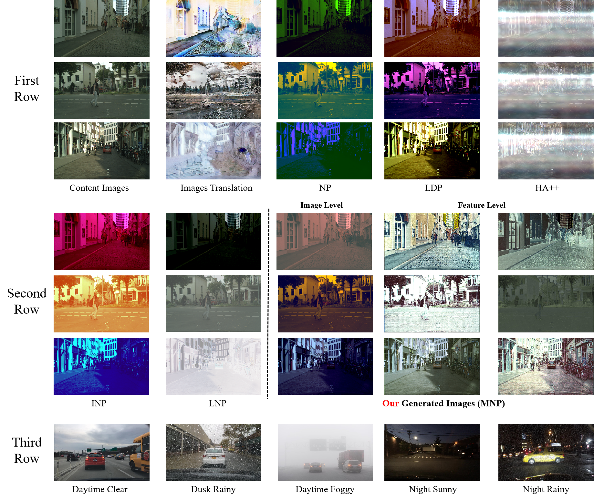

# icml-rebuttal

*Figure 1: We have expanded the visualizations of different style augmentation methods from the original paper. The first row includes a style transfer method and three state-of-the-art (SOTA) perturbation-based methods: NP (ICLR 2023), LDP (ICCV 2023), and HA++ (ICCV 2023). Among them, NP applies perturbations at the feature level, while LDP and HA++ introduce perturbations at the image level. It is important to note that HA++ requires images from other domains to guide the augmentation of the original image. In our experiments, we selected nighttime and foggy images as auxiliary images. In the second row, the first two columns present the INP and LNP methods, which constitute MNP. The third column illustrates the perturbation effects at the image level, while the fourth and fifth columns show the perturbation effects at the feature level. In the third row, we provide images from five different scenes in the Diversity Weather Dataset as real-world references for various environmental conditions.*
